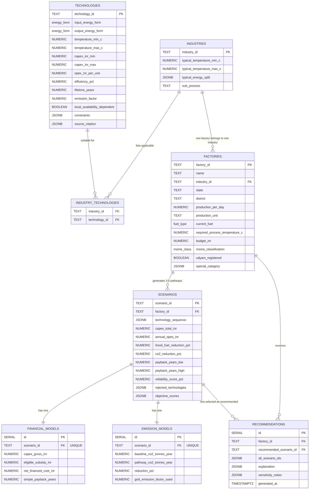

# SCHEMA_DOCS.md — Database Schema Documentation

> **Source of truth:** [`docs/DOMAIN_MODEL.md`](file:///c:/Users/shivam/OneDrive/Attachments/Desktop/CIETO/industrial-energy-optimizer/docs/DOMAIN_MODEL.md)
>
> **Migration file:** [`scripts/migrations/001_initial_schema.sql`](file:///c:/Users/shivam/OneDrive/Attachments/Desktop/CIETO/industrial-energy-optimizer/scripts/migrations/001_initial_schema.sql)
>
> **Created:** 2026-08-17 | **Target DB:** PostgreSQL 15+

---

## 1. Entity–Relationship Diagram



---

## 2. Foreign Key Relationships

| FK Column | Source Table | Target Table | Cardinality | ON DELETE | Notes |
|-----------|------------|--------------|-------------|-----------|-------|
| `industry_id` | `factories` | `industries` | N:1 | RESTRICT | A factory cannot exist without its industry |
| `industry_id` | `industry_technologies` | `industries` | N:1 | CASCADE | Junction row removed if industry deleted |
| `technology_id` | `industry_technologies` | `technologies` | N:1 | CASCADE | Junction row removed if technology deleted |
| `factory_id` | `scenarios` | `factories` | N:1 | CASCADE | All scenarios deleted when factory deleted |
| `scenario_id` | `financial_models` | `scenarios` | 1:1 (UNIQUE) | CASCADE | Financial model deleted with its scenario |
| `scenario_id` | `emission_models` | `scenarios` | 1:1 (UNIQUE) | CASCADE | Emission model deleted with its scenario |
| `factory_id` | `recommendations` | `factories` | N:1 | CASCADE | Recommendations deleted with factory |
| `recommended_scenario_id` | `recommendations` | `scenarios` | N:1 | CASCADE | Recommendation invalidated if scenario deleted |

---

## 3. Enum Types

### 3.1 `fuel_type`

| Value | Source |
|-------|--------|
| `coal` | DOMAIN_MODEL §1 + emission_factors.json |
| `furnace_oil` | DOMAIN_MODEL §1 + emission_factors.json |
| `pet_coke` | DOMAIN_MODEL §1 |
| `biomass` | DOMAIN_MODEL §1 + emission_factors.json |
| `electricity` | DOMAIN_MODEL §1 |
| `mixed` | DOMAIN_MODEL §1 |
| `diesel` | emission_factors.json |
| `lpg` | emission_factors.json |
| `natural_gas` | emission_factors.json |
| `biogas` | emission_factors.json |

### 3.2 `energy_form`

| Value | Used by |
|-------|---------|
| `biomass` | Technology input |
| `electricity` | Technology input/output |
| `solar` | Technology input |
| `waste_heat` | Technology input |
| `steam` | Technology output |
| `thermal` | Technology output |

### 3.3 `msme_class`

| Value | Udyam Threshold |
|-------|----------------|
| `micro` | Investment ≤ ₹1 Cr, Turnover ≤ ₹5 Cr |
| `small` | Investment ≤ ₹10 Cr, Turnover ≤ ₹50 Cr |
| `medium` | Investment ≤ ₹50 Cr, Turnover ≤ ₹250 Cr |

### 3.4 `project_type_enum`

13 values directly from DOMAIN_MODEL §1 `project_type` field. Drives scheme matching in Module 4a (post-MVP).

### 3.5 `project_lifecycle`

`existing` | `new` — gates scheme eligibility (e.g. PMEGP).

### 3.6 `site_type`

`brownfield` | `greenfield` | `not_applicable`

---

## 4. JSON Column Schemas

### 4.1 `industries.typical_energy_split`

```json
{
  "electricity_pct": 15,
  "thermal_pct": 85
}
```

### 4.2 `technologies.constraints`

```json
[
  "requires grid capacity upgrade",
  "requires existing boiler retrofit compatibility"
]
```

### 4.3 `technologies.source_citation`

```json
{
  "source_id": "SRC003",
  "source_type": "IPCC-based",
  "document": "IPCC 2006 Guidelines"
}
```

> Every technology number must be traceable to `references/citations.json`.

### 4.4 `factories.special_category`

```json
{
  "women_owned": false,
  "sc_st_owned": false,
  "pwd_owned": false,
  "agniveer_owned": false,
  "transgender_owned": false,
  "north_east_region": false,
  "jammu_kashmir": false,
  "ladakh": false,
  "aspirational_district": false,
  "identified_credit_deficient_district": false
}
```

### 4.5 `scenarios.technology_sequence`

```json
["heat_pump", "biomass", "solar_thermal"]
```

> Ordered array — sequence matters for pathway evaluation.

### 4.6 `scenarios.rejected_technologies`

```json
[
  {"technology_id": "electrification", "reason": "Grid reliability below 60% threshold"},
  {"technology_id": "waste_heat_recovery", "reason": "Process temperature exceeds WHR range"}
]
```

> Powers the "Why not?" explainability feature.

### 4.7 `scenarios.objective_scores`

```json
{
  "cost": 0.72,
  "emissions": 0.91,
  "risk": 0.65
}
```

> Inputs to MCDA ranking in `optimizer/mcda.py`.

### 4.8 `scenarios.financing_eligible_schemes`

```json
[
  {"scheme_id": "CLCSS", "subsidy_pct": 15, "max_amount_inr": 1500000},
  {"scheme_id": "MNRE_CFA", "subsidy_pct": 30}
]
```

### 4.9 `recommendations.explanation`

```json
{
  "why_selected": [
    "Lowest payback period (2.8 years)",
    "Highest CO2 reduction (72%)",
    "All technologies available locally"
  ],
  "why_others_rejected": [
    {"scenario_id": "S2", "reason": "Budget exceeds factory ceiling by 18%"},
    {"scenario_id": "S3", "reason": "Grid reliability insufficient for full electrification"}
  ]
}
```

### 4.10 `recommendations.sensitivity_notes`

```json
[
  "Payback extends to 4.4yr if electricity price rises 15%",
  "CO2 reduction drops to 58% if biomass supply disrupted for >2 months"
]
```

### 4.11 `recommendations.all_scenario_ids`

```json
["S1", "S2", "S3", "S4"]
```

> Full comparison set — UI shows all, not just the winner. Actual scenario data lives in the `scenarios` table.

---

## 5. Design Rationale

### 5.1 Range columns as separate min/max fields

The domain model specifies ranges (not point estimates) for `payback_years`, `temperature_range_c`, `capex_inr_range`, and `capacity_range`. These are stored as separate `_min` / `_max` NUMERIC columns instead of PostgreSQL array types for:

- **Queryability** — `WHERE temperature_max_c >= 200` is simpler than array indexing
- **CHECK constraints** — `CHECK (min <= max)` is straightforward
- **ORM compatibility** — SQLAlchemy maps scalars more naturally than arrays

### 5.2 JSON columns for nested/variable-shape data

Fields like `special_category`, `rejected_technologies`, `objective_scores`, and `explanation` have composite structures that would require excessive normalisation. JSONB provides:

- **Schema flexibility** — the exact shape can evolve without migrations
- **Query support** — PostgreSQL JSONB supports indexing and operators (`@>`, `->`, `->>`)
- **Domain model fidelity** — matches the original object/array shapes exactly

### 5.3 FinancialModel and EmissionModel as separate tables

Although the domain model says "embedded in Scenario," it explicitly notes they're "worth defining separately" and standalone Python model files (`financial.py`, `emission.py`) exist. A 1:1 relationship with UNIQUE constraint on `scenario_id` achieves both:

- **Code organisation** — separate ORM model classes matching the `models/` file structure
- **Logical separation** — financial and emission computations can evolve independently
- **Query efficiency** — scenarios can be listed without loading financial/emission details

### 5.4 Module 4a fields are nullable

Per ROADMAP.md Sprint 0 Decision 1, Module 4a (Policy & Eligibility) is **deferred to post-MVP**. All Module 4a fields (`project_type`, `project_cost_inr`, `loan_amount_inr`, etc.) are included for forward compatibility but are `NULL`-able. No policy-specific tables are created.

### 5.5 Fuel enum includes all known fuels

The `fuel_type` enum combines fuels from both DOMAIN_MODEL §1 (`coal`, `furnace_oil`, `pet_coke`, `biomass`, `electricity`, `mixed`) and `knowledge-base/emissions/emission_factors.json` (`diesel`, `lpg`, `natural_gas`, `biogas`) to avoid schema migrations when the decision engine begins using the full emissions dataset.

---

## 6. Traceability Matrix

| DOMAIN_MODEL Entity | SQL Table | PK | Domain Model Section |
|--------------------|-----------|----|---------------------|
| Factory | `factories` | `factory_id` | §1 |
| Industry | `industries` | `industry_id` | §2 |
| Technology | `technologies` | `technology_id` | §3 |
| Industry ↔ Technology | `industry_technologies` | (`industry_id`, `technology_id`) | §2–§3 |
| Scenario / Pathway | `scenarios` | `scenario_id` | §4 |
| Recommendation | `recommendations` | `id` (SERIAL) | §5 |
| FinancialModel | `financial_models` | `id` (SERIAL) | §6 |
| EmissionModel | `emission_models` | `id` (SERIAL) | §7 |
